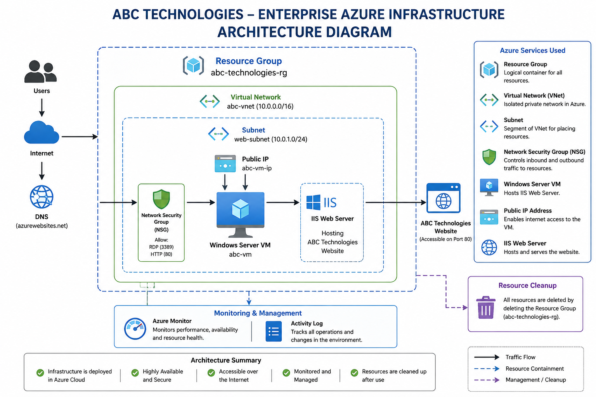
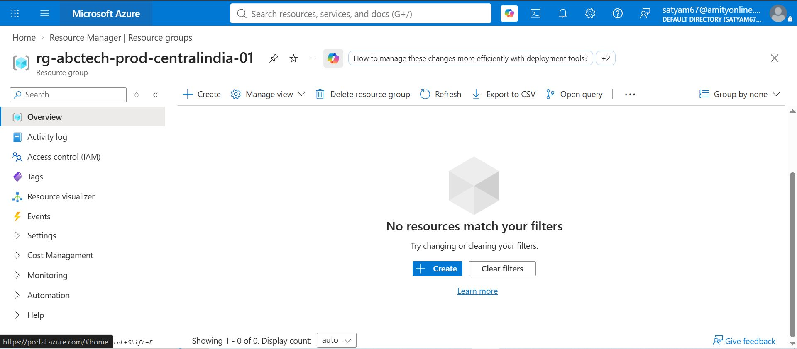
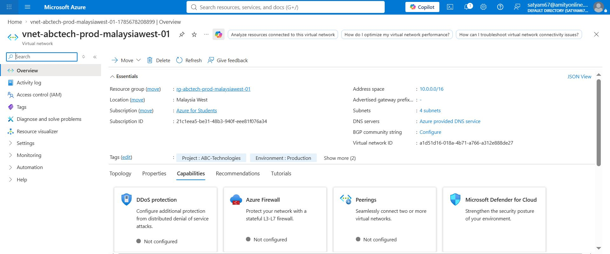
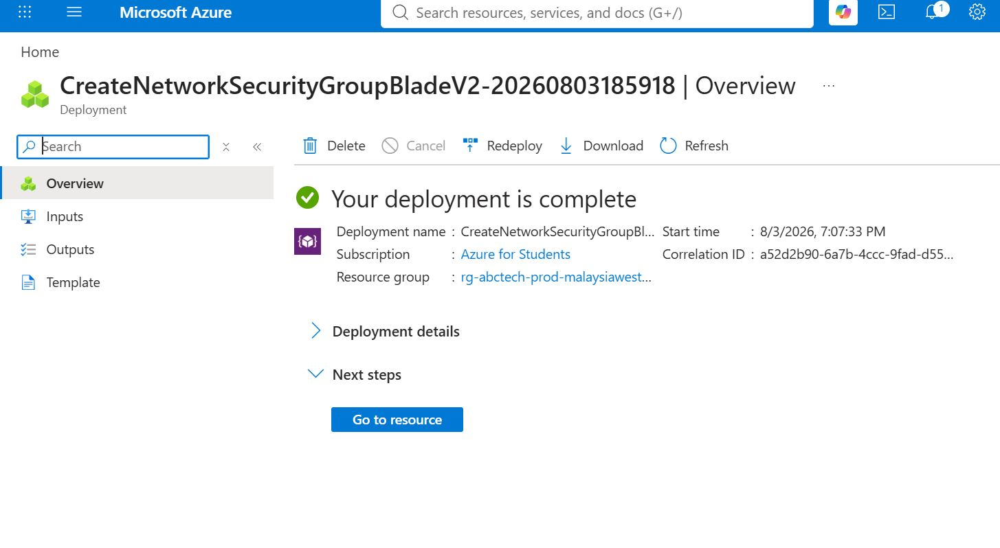
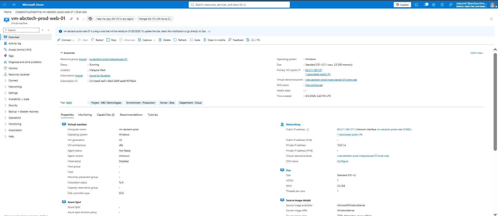
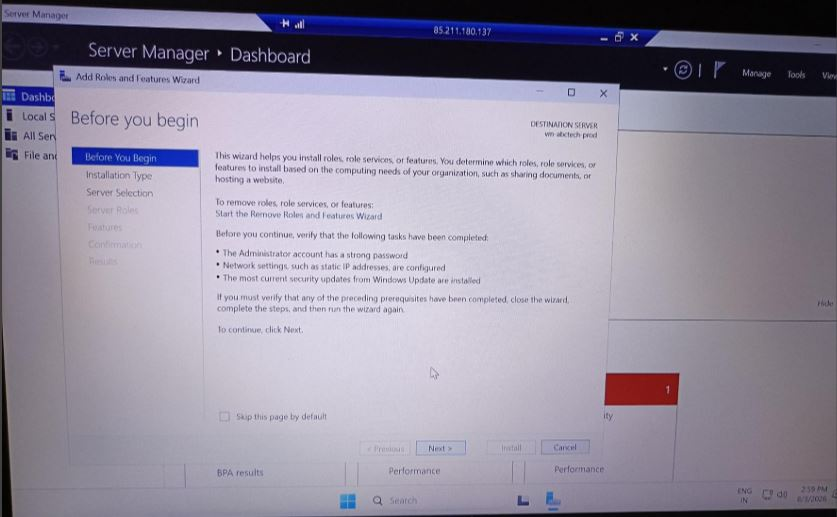
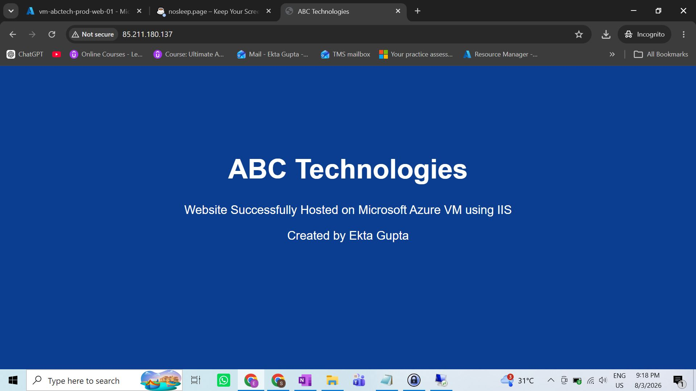
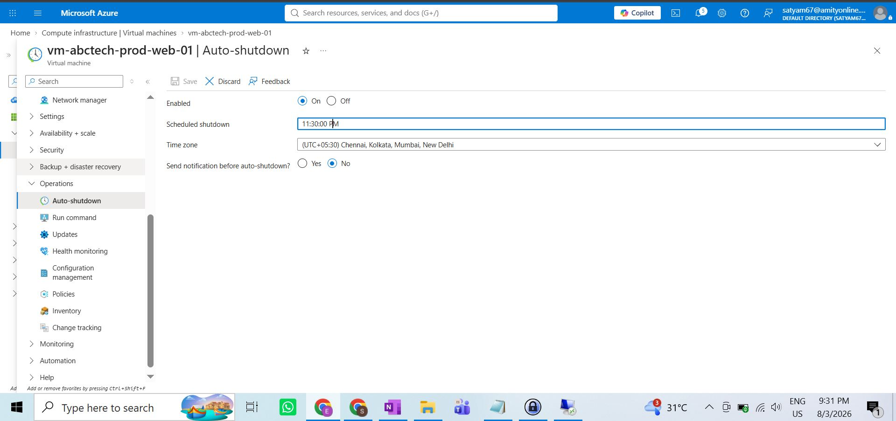
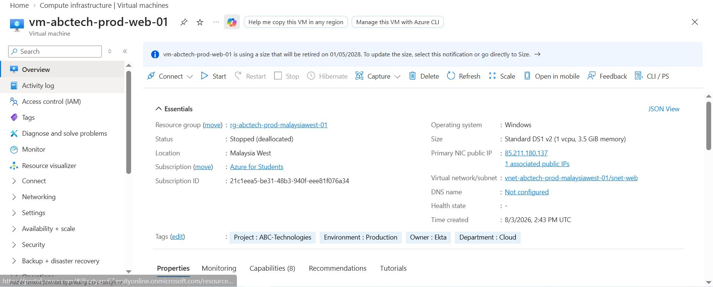
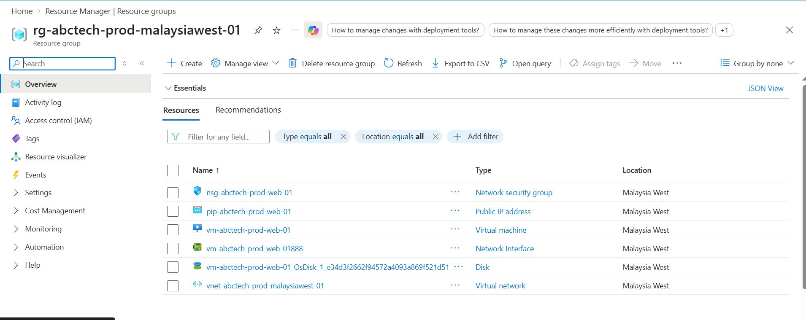

<h1 align="center">☁️ Azure Cloud Projects Portfolio</h1>
<p align="center">Hands-on Microsoft Azure infrastructure projects built during my Azure Administrator (AZ‑104) journey</p>

<p align="center">
  
  
  
  
</p>

<p align="center">
  <a href="https://www.linkedin.com/in/ekta-gupta-e6">LinkedIn</a> ·
  <a href="https://github.com/arcadekta-code">GitHub</a> ·
  <a href="https://learn.microsoft.com/api/credentials/share/en-us/KmEktaGupta-5513/D45F437B6385D8FA?sharingId=7428CE1C03CEC08D">AZ-104 Certificate</a>
</p>

---

## 👋 About This Repository

I'm **Ekta Gupta**, an Infrastructure Support Engineer transitioning into an **Azure Cloud Engineer** role. This repository is where I document real, hands-on Azure deployments — not just theory — as part of turning my AZ-104 certification into practical, provable experience.

Each project here follows the same discipline you'd expect in a real environment: a business scenario, a documented architecture, a resource naming standard, step-by-step deployment evidence, troubleshooting notes, and cost cleanup. The goal is to show *how* I work, not just *what* I know.

> 🚧 This is an active portfolio — new Azure projects are added as my learning continues.

---

## 🧰 Core Skills Demonstrated Across This Repo

| Category | Skills |
|---|---|
| **Azure Administration** | Resource Groups, Virtual Networks, Subnetting, NSGs, Public IPs, VM deployment, cost optimization |
| **Windows Server** | RDP administration, IIS installation & configuration, website hosting |
| **Cloud Concepts** | IaaS, secure network design, monitoring & activity logs, governed resource naming |
| **Documentation** | Architecture diagramming, deployment runbooks, troubleshooting logs |

---

## 📂 Repository Structure

```

azure-cloud-projects/
├── README.md                                          ← you are here
│
├── ABC-Technologies-Enterprise-Azure-Infrastructure/  ← Project 01
│   ├── README.md                 # Full project write-up
│   ├── Architecture/              # Architecture diagram
│   ├── Deployment-Steps/          # Step-by-step deployment logs (01–12)
│   ├── Screenshots/                # Screenshot index
│   ├── Source-Code/                # Hosted website source (index.html)
│   ├── Troubleshooting/            # Issues encountered + resolutions
│   └── Notes/
│
└── 01–15 \*.jpg / .JPG / .jfif      # Deployment evidence screenshots

````

---

## 🚀 Projects

| # | Project | Focus | Status |
|---|---|---|---|
| 01 | [ABC Technologies – Enterprise Azure Infrastructure](./ABC-Technologies-Enterprise-Azure-Infrastructure) | VNet/NSG design, Windows Server VM, IIS website hosting, cost cleanup | ✅ Complete |
| 02 | *Coming soon* | — | 🔜 Planned |

---

## 📌 Featured Project: ABC Technologies – Enterprise Azure Infrastructure

**Scenario:** ABC Technologies needed an internal training website hosted on Azure, with secure networking, a Windows Server VM running IIS, and disciplined cost management after go-live.

### Architecture

<p align="center">
  
</p>

### Azure Services Used

`Resource Groups` · `Virtual Network (VNet)` · `Subnet` · `Network Security Group (NSG)` · `Public IP` · `Windows Server VM` · `IIS` · `NIC` · `Managed OS Disk` · `Azure Monitor`

### Deployment Workflow

1. Create Resource Group → 2. Create VNet → 3. Create Subnet → 4. Create NSG → 5. Create Public IP → 6. Deploy Windows Server VM → 7. Connect via RDP → 8. Install IIS → 9. Deploy sample website → 10. Test via Public IP → 11. Stop/Deallocate VM → 12. Clean up resources

📖 Full step-by-step logs with configuration values: [`Deployment-Steps/`](./ABC-Technologies-Enterprise-Azure-Infrastructure/Deployment-Steps)

### Resource Naming Convention

| Resource | Name |
|---|---|
| Resource Group | `rg-abctech-prod-malaysiawest-01` |
| Virtual Machine | `vm-abctech-prod-web-01` |
| Virtual Network | `vnet-abctech-prod-malaysiawest-01` |
| Subnet | `snet-web` |
| Region | Malaysia West |

### Deployment Evidence

| | | |
|---|---|---|
|  Resource Group |  Virtual Network |  Network Security Group |
|  Windows Server VM |  IIS Installation |  Website Hosted Live |
|  Auto-Shutdown Configured |  VM Deallocated |  Resources Cleaned Up |

*15 screenshots total, covering the full lifecycle from resource creation to teardown.* [See all →](./ABC-Technologies-Enterprise-Azure-Infrastructure/Screenshots)

### Troubleshooting Highlights

- **Website unreachable initially** → root-caused to the NSG missing an inbound rule; resolved by allowing HTTP (port 80).
- **Post-project cost control** → VM stopped (deallocated) and Resource Group deleted immediately after evidence capture, avoiding ongoing compute charges.

Full log: [`Troubleshooting/README.md`](./ABC-Technologies-Enterprise-Azure-Infrastructure/Troubleshooting/README.md)

### What I Learned

Deploying networking from scratch (VNet → Subnet → NSG) taught me to think about traffic flow *before* opening ports, rather than opening ports reactively. Pairing every deployment step with a naming standard and a cleanup step made the project feel closer to how a real environment is run — provision with intent, document as you go, and don't leave meters running.

---

## 📫 Let's Connect

- **LinkedIn:** [ekta-gupta-e6](https://www.linkedin.com/in/ekta-gupta-e6)
- **GitHub:** [@arcadekta-code](https://github.com/arcadekta-code)
- **Certification:** [Microsoft Certified: Azure Administrator Associate (AZ-104)](https://learn.microsoft.com/api/credentials/share/en-us/KmEktaGupta-5513/D45F437B6385D8FA?sharingId=7428CE1C03CEC08D)

More Azure projects are on the way as this portfolio grows. ⭐ Star this repo if you'd like to follow along.
